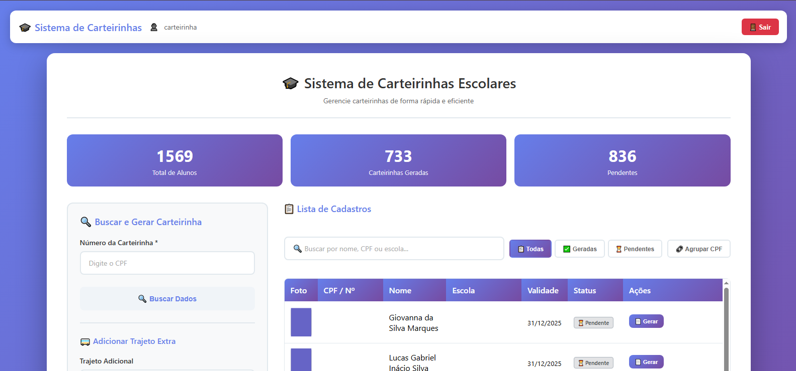

# Site de Geração de Carteirinhas

Incorpore um site responsivo para ter mais eficiência e organização na geração de Carteirinhas Escolares através Planilha Google.

# Integre no seu Google Sheets

Estão disponibilizados os dois arquivos responsaveis para a lógica e criação do Site.
Basta Copiar o conteúdo dentro deles e Colar dentro do *AppScript* da sua Planilha desejada, faça as devidas alterações para o funcionamento...

# Lembrando...

Não esqueça de habilitar o Serviço de Gmail no seu AppScript e Certifique-se de criar uma integração de um App Web e também configurar o Email automático com Alias.

# Avisos!!!

A filtragem de Pessoas funciona pela cor das células da coluna "Carimbo de data/hora", certifique-se de alterar a cor do fundo da pessoa que deseja que apareça no site para a cor "#00ff00"